# BookIt System Architecture Diagram

## Overall System Architecture

```mermaid
graph TB
    subgraph "Client Layer"
        User[👤 User Browser]
        Mobile[📱 Mobile/Desktop App]
    end
    
    subgraph "Frontend - App Engine"
        Flask[Flask Web Application<br/>Python 3.12]
        Templates[Jinja2 Templates<br/>HTML/CSS/JS]
        StaticFiles[Static Assets<br/>Images, CSS]
    end
    
    subgraph "Backend Services"
        Auth[Authentication Service<br/>bcrypt + Sessions]
        API[REST API Endpoints<br/>/api/*]
        Chat[AI Chatbot<br/>Rule-based]
    end
    
    subgraph "Data Layer - NoSQL"
        Firestore[(Google Cloud Firestore<br/>NoSQL Database)]
        FirestoreCollections[Collections:<br/>- users<br/>- events]
    end
    
    subgraph "Data Layer - SQL"
        CloudSQL[(Cloud SQL PostgreSQL<br/>Relational Database)]
        SQLTables[Tables:<br/>- bookings<br/>- transactions]
    end
    
    subgraph "Serverless Functions"
        CF1[Cloud Function:<br/>Booking Confirmation<br/>SendGrid Email]
        CF2[Cloud Function:<br/>Event Analytics<br/>Metrics Calculation]
    end
    
    subgraph "External APIs"
        SendGrid[SendGrid API<br/>Email Service]
        CloudAPIs[Google Cloud APIs<br/>Firestore, Cloud SQL]
    end
    
    User --> Flask
    Mobile --> API
    Flask --> Templates
    Flask --> Auth
    Flask --> API
    Flask --> Chat
    
    Auth --> Firestore
    API --> Firestore
    API --> CloudSQL
    Flask --> CloudSQL
    
    Firestore --> FirestoreCollections
    CloudSQL --> SQLTables
    
    Flask -.Async Call.-> CF1
    API -.On Demand.-> CF2
    
    CF1 --> SendGrid
    CF2 --> CloudSQL
    
    Flask --> CloudAPIs
    API --> CloudAPIs
    
    style Flask fill:#667eea,color:#fff
    style Firestore fill:#f90,color:#fff
    style CloudSQL fill:#4285f4,color:#fff
    style CF1 fill:#0f9d58,color:#fff
    style CF2 fill:#0f9d58,color:#fff
    style SendGrid fill:#1a82e2,color:#fff
```

## Data Flow Diagram

## Security Architecture

## Technology Stack Overview

## Testing Results Summary

## Deployment Architecture
